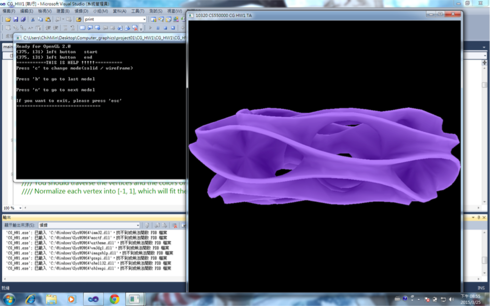
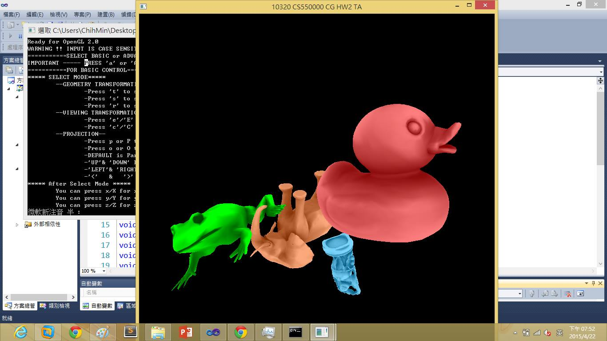
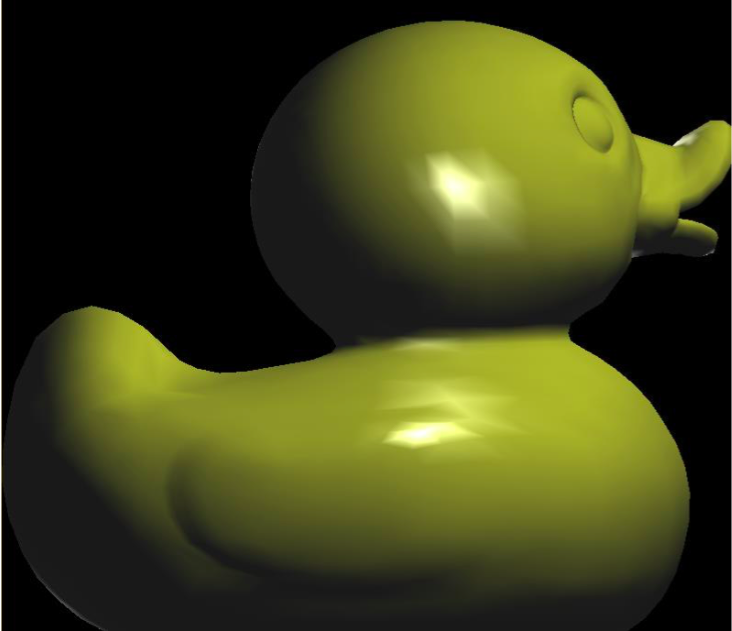
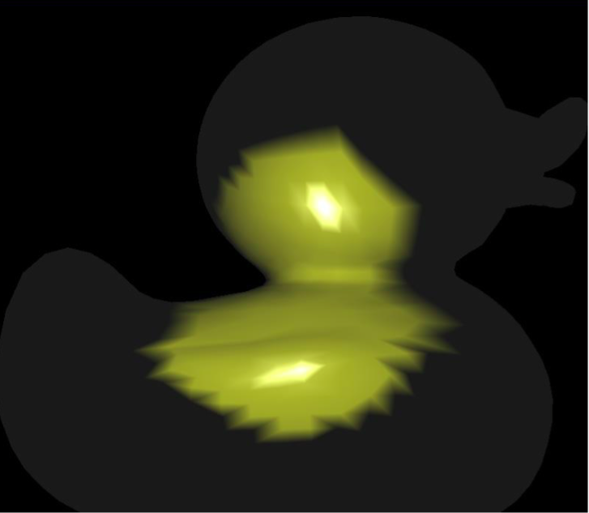
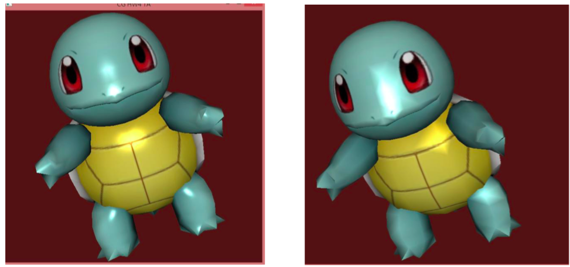

# Computer Graphics

This repo is used to save projects in computer graphics course.

- Language and Library: C++, OpenGL, GLSL
- Environment: Visual Studio 2010

The contents include:

1. Basic 3D model rendering 

   

2. 3D model transformation
   

3. Lighting

   - Point ligt

     

   - Spot light

     

4. Texture mapping

   Per-pixel lighting v.s. Vertex lighting

   

   ​

